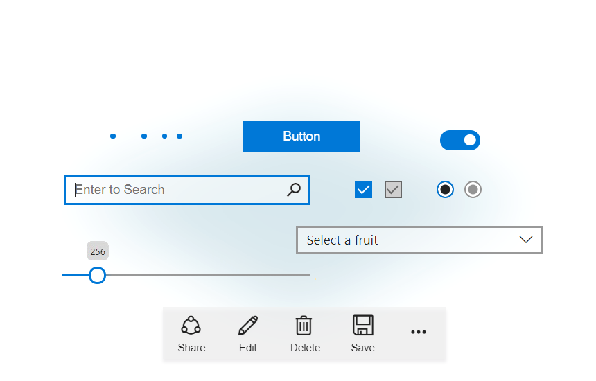
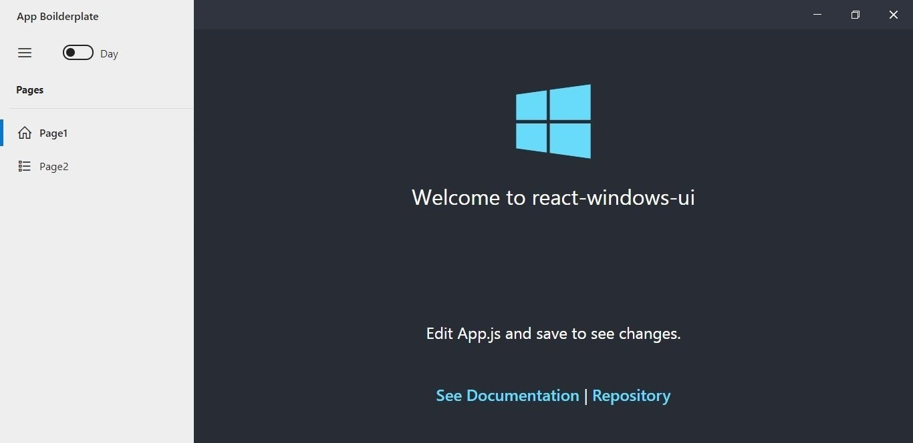
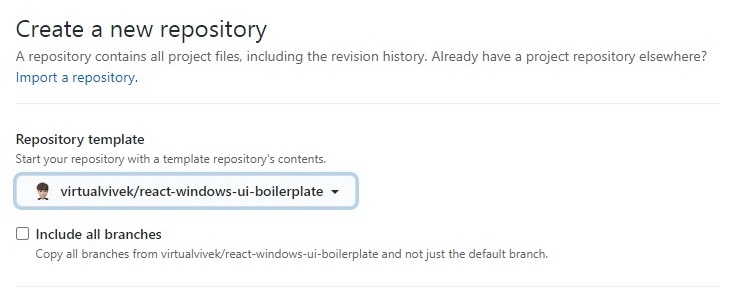
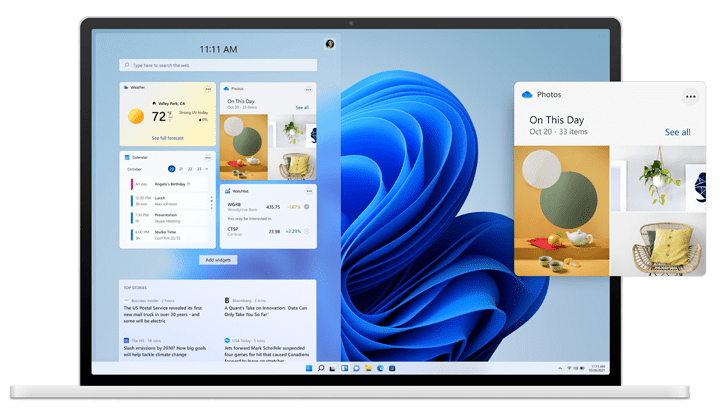

<p align="center"> 
   
</p>


<h1 align="center">react-windows-ui</h1>


<p align="center">Build full featured <b>Windows fluent UI</b> apps using <b>ReactJS</b>.</p>

<p align="center">
	 
  <a href="https://virtualvivek.github.io/react-windows-ui/">
    
  </a>
	
  <a href="https://github.com/virtualvivek/react-windows-ui/blob/main/LICENSE">
    
  </a>
  
  <a href="https://github.com/virtualvivek/react-windows-ui/releases">
    
  </a>
  
  <a href="https://virtualvivek.github.io/react-windows-ui/">
    
  </a>
  
  <a href="https://www.npmjs.com/package/react-windows-ui">
    
  </a>

</p>


<p align="center"></p>

<h1 align="center">Adaptive UI</h1>

<p align="center"></p>

# Demo ⚡
https://virtualvivek.github.io/react-windows-ui/


# Installation
```ruby
$ npm install react-windows-ui
```

# Getting Started

```js
// Be sure to include styles at some point, probably during your bootstraping
import 'react-windows-ui/config/app-config.css'
import 'react-windows-ui/dist/react-windows-ui.min.css'
import 'react-windows-ui/icons/fonts/fonts.min.css'
```
### app-config

‣ `app-config.css` file contains the `PrimaryColor`, `Fontfamily` used by the app. <br>
‣ You can import default `app-config` using this file <a href="src/lib/config/app-config.css">app-config.css</a>.<br>
_OR_ <br>
Create your own like this

```css
:root {
  --PrimaryColor: #6632a8;  /* Change color you like */
}
body {
  font-family: "Segoe UI";  /* Change fontfamily you like */
}
```

# Usage

```js
import { Button, InputText } from 'react-windows-ui';

const App = () => (
  <>
    <Button type="primary" value="Press Me" />
    <InputText placeholder="Enter a text" />
  </>
);
```
# [Boilerplate](https://github.com/virtualvivek/react-windows-ui-boilerplate)


You can initialize you Repo with this `Template` <br>


OR <br>
**Clone as a Repository:**
[virtualvivek/react-windows-ui-boilerplate](https://github.com/virtualvivek/react-windows-ui-boilerplate)

## Run Demo Locally
```ruby
$ git clone https://github.com/virtualvivek/react-windows-ui.git
$ cd react-windows-ui
$ npm install
$ npm start
```

<h1 align="center">Windows 11 Styles.css</h1>
<p align="center"></p>

```js
// include windows 11 styles at some point, probably during your bootstraping
...
import 'react-windows-ui/dist/react-windows-ui-sunvalley.min.css'
...
```

# RTL Support
Distribute layout direction from Right to Left.
```js
// include rtl styles at some point, probably during your bootstraping
...
import 'react-windows-ui/dist/react-windows-ui-rtl.min.css'
...
```


# Links

<table>
<thead>
<tr>
  <th align="left">Name</th>
  <th align="left">Details</th>
  <th align="left">Link</th>
</tr>
</thead>
<tbody>
<tr>
  <td>Example Codes</td>
  <td>Components implementation <code>demo</code></td>
  <td><a href="https://github.com/virtualvivek/react-windows-ui/tree/main/src/demo/">Example LINK</a></td>
</tr>
<tr>
  <td>Library Source Directory</td>
  <td>Folder publish to <code>npm</code></td>
  <td><a href="https://github.com/virtualvivek/react-windows-ui/tree/main/src/lib">Library LINK</a></td>
</tr>
<tr>
  <td>Library SCSS Source</td>
  <td>Style <code>scss</code> source code</td>
  <td><a href="https://github.com/virtualvivek/react-windows-ui/tree/main/src/source/stylesheet">SCSS LINK</a></td>
</tr>
<tr>
  <td>Library SunValley SCSS Source</td>
  <td>SunValley Styles <code>scss</code> source code</td>
  <td><a href="https://github.com/virtualvivek/react-windows-ui/tree/main/src/source/stylesheet-sunvalley">SCSS LINK</a></td>
</tr>
<tr>
  <td>TypeScript Type Definitions</td>
  <td>Typescript <code>index.d.ts</code> import file</td>
  <td><a href="https://github.com/virtualvivek/react-windows-ui/blob/main/src/lib/src/index.d.ts">D.TS LINK</a></td>
</tr>
</tbody>
</table>

---

# Details

<a href="https://www.npmjs.com/package/react-windows-ui">
  
</a>
<br>
<a href="https://github.com/virtualvivek/react-windows-ui/tree/main/src/lib/dist">
  
</a>
<br>
<a href="https://github.com/virtualvivek/react-windows-ui/tree/main/src/lib/dist">
  
</a>
<br>
<a href="https://github.com/virtualvivek/react-windows-ui/tree/main/src/lib/dist">
  
</a>

# Find this library useful? :heart:
Support it by joining [**stargazers**](https://github.com/virtualvivek/react-windows-ui/stargazers) for this repository. :star:


# License

**`react-windows-ui`** is licensed under `MIT license`. View [license](https://github.com/virtualvivek/react-windows-ui/blob/main/LICENSE).<br>
Copyright (c) 2021 [**Vivek Verma**](https://github.com/virtualvivek)
